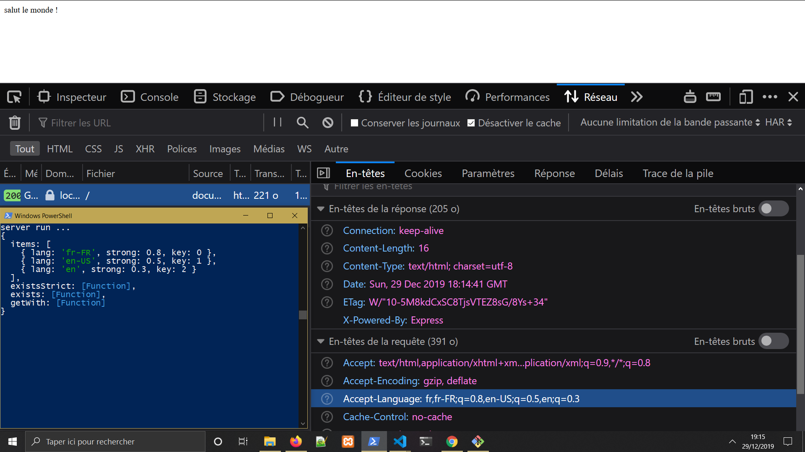

# [express-langs](https://www.npmjs.com/package/express-langs)

[](https://www.npmjs.com/package/express-langs)
[](https://www.npmjs.com/package/express-langs)



## parse langs from `request` for easier use with *express*

> resolve langagues **accept** in header `request` get `array` langagues with `request.langs`

### Installation


```npm install express-langs --save```

```yarn add express-langs```


server.js

```javascript
const
    exp = require('express')
    , app = exp()
    , langs = require('express-langs')
;

app
    // your other middleware ...
    .use( langs() )
    // your other middleware ...
;

app.get('/' , ( req , res ) => {

    console.log( req.langs ) ;

    res.send('hello world !') ;

} )

```


### you can give an **default langagues** optional if **header** `ACCEPT` is not defined or `null`

server.js

```javascript
// , ...
app
    // your other middleware ...
    .use( langs('en') )
    // your other middleware ...
;
// ... ,
```

### develop by [Samuel Gaborieau]( https://orivoir.github.io/profil-reactjs/ ) with <3 and NodeJS for *Open Source* and *enjoy* !
